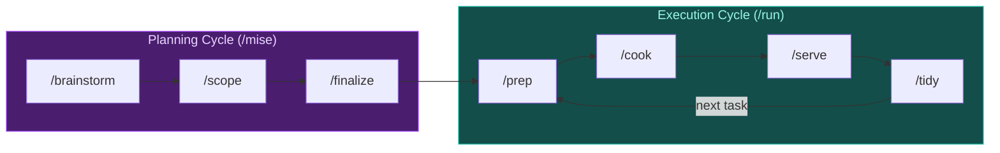

# Line Cook

**You design. It ships.**

Focus on the what and why—Line Cook handles the how. Structured execution with guardrails that keeps you in deep work while AI runs the prep→cook→serve→tidy cycle—syncing state, executing tasks, reviewing changes, and committing work.

## Core Concepts

Before diving in, understand two key ideas:

**Sessions, not streams.** AI context is finite. Work in bounded sessions—prep, cook, serve, tidy—then clear context and start fresh. Don't treat AI conversations as endless streams. Each session ends with a push; discoveries become tracked issues for the next session.

**You plan, it executes.** Brainstorm with the AI to scope work and create issues. Then hand off to Line Cook for disciplined execution. Don't mix modes—creative exploration and systematic execution are different phases with different goals.

> **Learn more:** [Mental Models](docs/mental-models.md) explains these concepts in depth.

## Quick Start

```bash
# 1. Install beads (git-native issue tracker)
brew install steveyegge/beads/bd && bd init

# 2. Plan your work
/line:mise

# 3. Execute the workflow
/line:run
```

That's it. Line Cook syncs your repo, picks a ready task, executes it with guardrails, reviews the work, and commits when done.

> **New to Line Cook?** Run `/line:getting-started` for a quick workflow guide.

## When NOT to Use Line Cook

Line Cook adds structure. Structure has overhead. Skip it when:

- **Quick one-off fixes** - Just make the change and commit
- **Exploratory coding** - When you're learning or prototyping
- **Pair programming** - When you're actively collaborating in real-time
- **Tiny projects** - If setup takes longer than the work

Use Line Cook when:
- Work spans multiple sessions
- Tasks have dependencies
- You want automated review
- You're building trust in AI workflows

## What It Does



| Command | What happens |
|---------|--------------|
| `/getting-started` | Quick workflow guide for beginners |
| `/mise` | Create work breakdown (orchestrates brainstorm→scope→finalize) |
| `/brainstorm` | Explore problem space (divergent thinking) |
| `/scope` | Create structured work breakdown |
| `/finalize` | Convert plan to beads + create test specs |
| `/audit` | Audit bead structure, quality, and hygiene |
| `/prep` | Sync git, show ready tasks |
| `/cook` | Execute task with TDD cycle |
| `/serve` | Review code changes |
| `/tidy` | Commit and push changes |
| `/plate` | Validate completed feature |
| `/run` | Run full workflow cycle |

> **Session boundary:** After `/tidy` pushes your work, start a new session or clear context (`/compact`) before starting `/prep` for the next task.

### The Planning Cycle (/mise)

Line Cook separates planning into three cognitive phases:

| Phase | Command | Mode | Output |
|-------|---------|------|--------|
| Brainstorm | `/brainstorm` | Divergent | `docs/planning/brainstorm-<name>.md` |
| Scope | `/scope` | Convergent | `docs/planning/menu-plan.yaml` |
| Finalize | `/finalize` | Execution prep | Beads + test specs |

**Why three phases?** Each phase has a natural pause point for review. Brainstorm expands possibilities, plan narrows to structure, finalize commits to tracked artifacts. This prevents premature commitment and allows iteration at each level.

**Flexibility:**
- `/mise` - Full flow with pause points between phases
- `/mise skip-brainstorm` - Skip exploration when requirements are clear
- Individual commands (`/brainstorm`, `/scope`, `/finalize`) - Maximum control

> **Learn more:** [Workflow Guide](docs/guidance/workflow.md) explains the planning cycle in detail.

## Getting Started

**Two starting points** depending on where you are:

| Starting Point | What to Do |
|----------------|------------|
| **"I know what to build"** | `/line:mise` to validate scope and create beads → `/line:prep` |
| **"I have a vague idea"** | `/line:mise` to brainstorm, scope, and create beads → `/line:prep` |

Both paths use `/mise`—even if you know what you want, it helps create well-scoped tasks that fit in single sessions.

**Tutorials** walk through the complete journey from idea to execution:
- [Claude Code Tutorial](docs/tutorial-claude-code.md)
- [OpenCode Tutorial](docs/tutorial-opencode.md)
- [Kiro Tutorial](docs/tutorial-kiro.md)

**Learn the commands** by running them individually first:

```bash
# 1. Mise: Create work breakdown before starting
/line:mise

# 2. Prep: Sync git and see available tasks
/line:prep

# 3. Cook: Execute task with TDD cycle
/line:cook

# 4. Serve: Review code changes
/line:serve

# 5. Tidy: Commit and push changes
/line:tidy

# 6. Plate: Validate completed feature
/line:plate <feature-id>
```

Once comfortable with each step, use `/line:run` to run them all together.

## Installation

> **Requires:**
> - [beads](https://github.com/steveyegge/beads) - Git-native issue tracker that gives AI memory between sessions: `brew install steveyegge/beads/bd` (or see repo for npm/go options)
> - Git
> - Claude Code or OpenCode

### Claude Code

**Remote (recommended):**
```bash
/plugin marketplace add smileynet/line-cook
/plugin install line@line-cook
```
Update: `/plugin update line`

**Local (for development):**
```bash
git clone https://github.com/smileynet/line-cook.git ~/line-cook
cd ~/line-cook && ./scripts/install-claude-code.sh
```
Update: `cd ~/line-cook && git pull && ./scripts/install-claude-code.sh`

> **Note:** Local plugins cannot use `/plugin update`. To switch from local to remote, run `/plugin uninstall line` first.

Commands: `/line:getting-started`, `/line:mise`, `/line:brainstorm`, `/line:scope`, `/line:finalize`, `/line:audit`, `/line:prep`, `/line:cook`, `/line:serve`, `/line:tidy`, `/line:plate`, `/line:run`

### OpenCode

**Remote:**
```bash
opencode plugin install https://github.com/smileynet/line-cook
```

**Local:**
> Requires [bun](https://bun.sh/) for building

```bash
git clone https://github.com/smileynet/line-cook.git ~/line-cook
cd ~/line-cook/line-cook-opencode && bun run build && ./install.sh
```

Commands: `/line-getting-started`, `/line-mise`, `/line-brainstorm`, `/line-scope`, `/line-finalize`, `/line-audit`, `/line-prep`, `/line-cook`, `/line-serve`, `/line-tidy`, `/line-plate`, `/line-run`

### Kiro

Copy the `line-cook-kiro/` directory to your `.kiro/` folder:

```bash
git clone https://github.com/smileynet/line-cook.git ~/line-cook
cp -r ~/line-cook/line-cook-kiro/* ~/.kiro/
```

Commands: `prep`, `cook`, `serve`, `tidy`, `work`

## The Guardrails

Line Cook enforces discipline so you don't have to:

- **Sync before work** - Always start with current state
- **One task at a time** - Focus prevents scope creep
- **Verify before done** - Tests pass, code compiles
- **File, don't block** - Discovered issues become new beads
- **Push before stop** - Work isn't done until it's pushed

> **Tip: Parking Lot Epics**
>
> Create "Retrospective" or "Backlog" epics for deferred work. Tasks filed under these epics are automatically excluded from `/prep` and `/cook` auto-selection, keeping focus on active work. You can still work on them explicitly via `/line:cook <task-id>`.

## Why Line Cook?

Line Cook sits between manual prompting and full autonomy:

| Approach | Control | Automation |
|----------|---------|------------|
| Manual prompting | Full | None |
| Beads | High | Low |
| **Line Cook** | Medium | Medium |
| Gas Town | Low | High |

The goal: build confidence in AI workflows before going full YOLO mode.

### The Kitchen Metaphor

- **Chef** (you) plans the menu during brainstorming
- **Line cook** (this tool) executes orders systematically

A good line cook follows the recipe and calls out problems—but doesn't redesign the dish mid-service.

## Influences

Built on ideas from:

- **[beads](https://github.com/steveyegge/beads)** - Git-native issue tracking for AI development. Line Cook orchestrates beads execution.
- **[Gas Town](https://github.com/steveyegge/gastown)** - Autonomous agent framework. Line Cook is the stepping stone toward that level of trust.
- **[Vibe Coding](https://bookshop.org/p/books/vibe-coding-building-production-grade-software-with-genai-chat-agents-and-beyond-gene-kim/b6e53e37eeba8cac)** - Gene Kim & Steve Yegge's book on AI-assisted development. The "file, don't block" principle and checkpoint patterns come from here.

## Project Structure

```
line-cook/
├── .claude-plugin/     # Plugin manifest
├── agents/             # Claude Code subagents (taster, sous-chef, maître)
├── commands/           # Claude Code slash commands
├── line-cook-opencode/ # OpenCode plugin
├── line-cook-kiro/     # Kiro agent and steering
├── scripts/            # Installation helpers
├── README.md           # This file
└── AGENTS.md           # Technical reference
```

## Development

**Plugin commands** (`commands/`) are distributed to end users. After modifying, reinstall to test:

```bash
./scripts/install-claude-code.sh
```

Then test the command in a new Claude Code session (or use `/plugin reload line` if available).

**Project-local dev commands** (`.claude/commands/`) are only available when working in the line-cook repository. These are not distributed with the plugin:

- `/smoke-test` - Run end-to-end command execution tests

## FAQ

**What if I don't use beads?**

You can still run the commands—they'll work. But you lose the "memory between sessions" benefit. Without beads, there's no persistent record of what was done, what's blocked, or what was discovered. Consider beads as optional but highly recommended.

**Can I use this with GitHub Issues / Jira?**

Yes. Beads is additive, not exclusive. Use your main tracker for team visibility and beads for your local AI workflow. Some teams sync the two; others keep them separate.

**What if my project doesn't have tests?**

`/cook` verification will be limited to "code compiles." You lose the automated quality gate, so review in `/serve` becomes more important. Consider adding tests incrementally as you work.

**How long should a task be?**

A task should take roughly 5-10 minutes of AI execution time. If it's taking longer, that's often a sign the task isn't decomposed enough. Break it down with dependencies—smaller tasks mean more checkpoints and easier recovery.

**Can I run commands out of order?**

Yes. Each command is independent. But the guardrails exist for a reason: `/prep` ensures you're synced, `/serve` catches issues before commit, `/tidy` ensures work is pushed. Skipping steps means accepting more risk.

**What does "headless Claude" mean?**

Headless means Claude running as a background process—no interactive terminal, just a prompt in and results out. `/serve` uses headless Claude to get a fresh review of your changes from a separate context.

**Why clear context between tasks?**

AI context windows are finite. Old discussions crowd out new work. Clearing between tasks ensures each session starts focused. Your beads persist—only the conversation history resets.

## License

MIT

## Related

- [beads](https://github.com/steveyegge/beads) - Git-native issue tracking
- [Gas Town](https://github.com/steveyegge/gastown) - Autonomous agent framework
