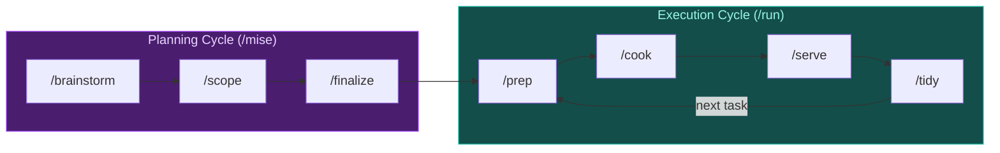

# Line Cook

**You design. It ships.**

Focus on the what and why—Line Cook handles the how. Structured execution with guardrails that keeps you in deep work while AI runs the prep→cook→serve→tidy cycle.

## Quick Start

After [installing](#installation) Line Cook and beads:

```bash
bd init              # Initialize beads in your project
/line:mise           # Plan your work
/line:run            # Execute workflow
```

> **New here?** Run `/line:getting-started` for a walkthrough, or see [Tutorials](#learn-more).

## Philosophy

**Sessions, not streams.** AI context is finite. Work in bounded sessions—prep, cook, serve, tidy—then clear context and start fresh. Each session ends with a push; discoveries become tracked issues for the next session.

**You plan, it executes.** Brainstorm with AI to scope work and create issues. Then hand off to Line Cook for disciplined execution. Don't mix modes—creative exploration and systematic execution are different phases.

> **Deep dive:** [Mental Models](docs/mental-models.md) explains these concepts in depth.

## When to Use

**Use Line Cook when:**
- Work spans multiple sessions
- Tasks have dependencies
- You want automated review
- You're building trust in AI workflows

**Skip it when:**
- Quick one-off fixes
- Exploratory coding or prototyping
- Active pair programming
- Setup takes longer than the work

## Workflow



| Command | What happens |
|---------|--------------|
| `/getting-started` | Quick workflow guide |
| `/mise` | Create work breakdown (brainstorm→scope→finalize) |
| `/prep` | Sync git, show ready tasks |
| `/cook` | Execute task with TDD cycle |
| `/serve` | Review code changes |
| `/tidy` | Commit and push changes |
| `/plate` | Validate completed feature |
| `/run` | Run full workflow cycle |

> **Session boundary:** After `/tidy` pushes your work, start a new session or clear context before the next task.

> **Full reference:** [Workflow Guide](docs/guidance/workflow.md)

## Installation

### 1. Install beads

[Beads](https://github.com/steveyegge/beads) provides git-native issue tracking with memory between sessions.

```bash
brew install steveyegge/beads/bd
```

> See [beads repo](https://github.com/steveyegge/beads) for npm/go options.

### 2. Install Line Cook

**Claude Code:**
```bash
/plugin marketplace add smileynet/line-cook
/plugin install line@line-cook
```
> Update: `/plugin update line` | [Full tutorial](docs/tutorial-claude-code.md)

**OpenCode:**
```bash
opencode plugin install https://github.com/smileynet/line-cook
```
> [Full tutorial](docs/tutorial-opencode.md)

**Kiro:**
```bash
git clone https://github.com/smileynet/line-cook.git ~/line-cook
cp -r ~/line-cook/plugins/kiro/* ~/.kiro/
```
> [Full tutorial](docs/tutorial-kiro.md)

## Learn More

- [Claude Code Tutorial](docs/tutorial-claude-code.md) — Complete walkthrough
- [Workflow Guide](docs/guidance/workflow.md) — Command reference and phases
- [Mental Models](docs/mental-models.md) — Core concepts explained
- [AGENTS.md](AGENTS.md) — Technical reference for contributors

## FAQ

**What if I don't use beads?**
You can still run the commands—they'll work. But you lose the "memory between sessions" benefit. Without beads, there's no persistent record of what was done, what's blocked, or what was discovered.

**How long should a task be?**
A task should take roughly 5-10 minutes of AI execution time. If it's taking longer, break it down with dependencies—smaller tasks mean more checkpoints and easier recovery.

**What does "headless Claude" mean?**
Headless means Claude running as a background process—no interactive terminal, just a prompt in and results out. `/serve` uses headless Claude to get a fresh review of your changes.

**Why clear context between tasks?**
AI context windows are finite. Old discussions crowd out new work. Clearing between tasks ensures each session starts focused. Your beads persist—only the conversation history resets.

## License

MIT

## Related

- [beads](https://github.com/steveyegge/beads) — Git-native issue tracking
- [Gas Town](https://github.com/steveyegge/gastown) — Autonomous agent framework
