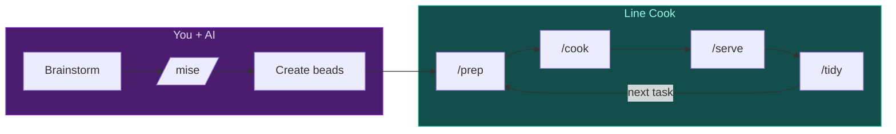

# Line Cook

**You design. It ships.**

Focus on the what and why—Line Cook handles the how. Structured execution with guardrails that keeps you in deep work while AI runs the prep→cook→serve→tidy cycle.

## Quick Start

```bash
# 1. Initialize beads in your project
bd init

# 2. Create some tasks
bd create --title="Implement user auth" --type=feature --priority=1
bd create --title="Add login form" --type=task

# 3. Run the workflow
/line:service
```

That's it. Line Cook syncs your repo, picks a ready task, executes it with guardrails, reviews the work, and commits when done.

> **New to Line Cook?** Run `/line:getting-started` for a quick workflow guide.

## What It Does



| Command | What happens |
|---------|--------------|
| `/getting-started` | Quick workflow guide for beginners |
| `/mise` | Create work breakdown before starting |
| `/prep` | Sync git, show ready tasks |
| `/cook` | Execute task with TDD cycle |
| `/serve` | Review code changes |
| `/tidy` | Commit and push changes |
| `/plate` | Validate completed feature |
| `/service` | Run full workflow cycle |

> **Session boundary:** After `/tidy` pushes your work, start a new session or clear context (`/compact`) before starting `/prep` for the next task.

## Getting Started

**Tutorials:** Step-by-step guides from brainstorming to your first work cycle:
- [Claude Code Tutorial](docs/tutorial-claude-code.md)
- [OpenCode Tutorial](docs/tutorial-opencode.md)
- [Kiro Tutorial](docs/tutorial-kiro.md)

Run each command individually first to understand what happens at each step:

```bash
# 1. Mise: Create work breakdown before starting
/line:mise

# 2. Prep: Sync git and see available tasks
/line:prep

# 3. Cook: Execute task with TDD cycle
/line:cook

# 4. Serve: Review code changes
/line:serve

# 5. Tidy: Commit and push changes
/line:tidy

# 6. Plate: Validate completed feature
/line:plate <feature-id>
```

Once comfortable with each step, use `/line:service` to run them all together.

## Installation

> **Requires:**
> - [beads](https://github.com/steveyegge/beads): `brew install steveyegge/beads/bd` (or see repo for npm/go options)
> - Git
> - Claude Code or OpenCode

### Claude Code

**Remote (recommended):**
```bash
/plugin marketplace add smileynet/line-cook
/plugin install line@line-cook
```
Update: `/plugin update line`

**Local (for development):**
```bash
git clone https://github.com/smileynet/line-cook.git ~/line-cook
cd ~/line-cook && ./scripts/install-claude-code.sh
```
Update: `cd ~/line-cook && git pull && ./scripts/install-claude-code.sh`

> **Note:** Local plugins cannot use `/plugin update`. To switch from local to remote, run `/plugin uninstall line` first.

Commands: `/line:getting-started`, `/line:mise`, `/line:prep`, `/line:cook`, `/line:serve`, `/line:tidy`, `/line:plate`, `/line:service`

### OpenCode

**Remote:**
```bash
opencode plugin install https://github.com/smileynet/line-cook
```

**Local:**
> Requires [bun](https://bun.sh/) for building

```bash
git clone https://github.com/smileynet/line-cook.git ~/line-cook
cd ~/line-cook/line-cook-opencode && bun run build && ./install.sh
```

Commands: `/line-getting-started`, `/line-mise`, `/line-prep`, `/line-cook`, `/line-serve`, `/line-tidy`, `/line-plate`, `/line-service`

### Kiro

Copy the `line-cook-kiro/` directory to your `.kiro/` folder:

```bash
git clone https://github.com/smileynet/line-cook.git ~/line-cook
cp -r ~/line-cook/line-cook-kiro/* ~/.kiro/
```

Commands: `prep`, `cook`, `serve`, `tidy`, `work`

## The Guardrails

Line Cook enforces discipline so you don't have to:

- **Sync before work** - Always start with current state
- **One task at a time** - Focus prevents scope creep
- **Verify before done** - Tests pass, code compiles
- **File, don't block** - Discovered issues become new beads
- **Push before stop** - Work isn't done until it's pushed

> **Tip: Parking Lot Epics**
>
> Create "Retrospective" or "Backlog" epics for deferred work. Tasks filed under these epics are automatically excluded from `/prep` and `/cook` auto-selection, keeping focus on active work. You can still work on them explicitly via `/line:cook <task-id>`.

## Why Line Cook?

Line Cook sits between manual prompting and full autonomy:

| Approach | Control | Automation |
|----------|---------|------------|
| Manual prompting | Full | None |
| Beads | High | Low |
| **Line Cook** | Medium | Medium |
| Gas Town | Low | High |

The goal: build confidence in AI workflows before going full YOLO mode.

### The Kitchen Metaphor

- **Chef** (you) plans the menu during brainstorming
- **Line cook** (this tool) executes orders systematically

A good line cook follows the recipe and calls out problems—but doesn't redesign the dish mid-service.

## Influences

Built on ideas from:

- **[beads](https://github.com/steveyegge/beads)** - Git-native issue tracking for AI development. Line Cook orchestrates beads execution.
- **[Gas Town](https://github.com/steveyegge/gastown)** - Autonomous agent framework. Line Cook is the stepping stone toward that level of trust.
- **[Vibe Coding](https://bookshop.org/p/books/vibe-coding-building-production-grade-software-with-genai-chat-agents-and-beyond-gene-kim/b6e53e37eeba8cac)** - Gene Kim & Steve Yegge's book on AI-assisted development. The "file, don't block" principle and checkpoint patterns come from here.

## Project Structure

```
line-cook/
├── .claude-plugin/     # Plugin manifest
├── agents/             # Claude Code subagents (taster, sous-chef, maître)
├── commands/           # Claude Code slash commands
├── line-cook-opencode/ # OpenCode plugin
├── line-cook-kiro/     # Kiro agent and steering
├── scripts/            # Installation helpers
├── README.md           # This file
└── AGENTS.md           # Technical reference
```

## License

MIT

## Related

- [beads](https://github.com/steveyegge/beads) - Git-native issue tracking
- [Gas Town](https://github.com/steveyegge/gastown) - Autonomous agent framework
